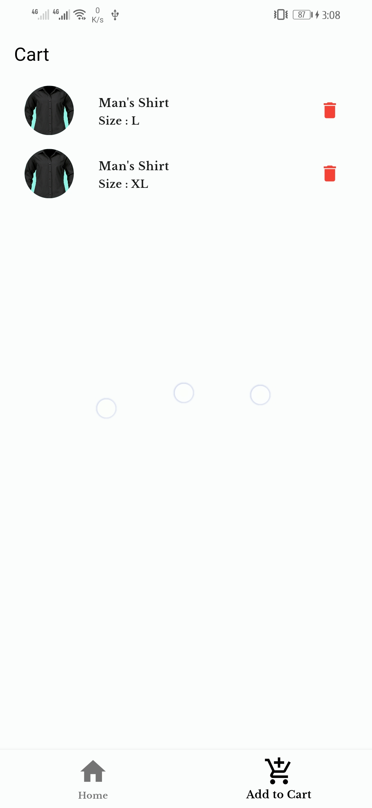

# Enduee - Clothes Shopping App

Enduee is a Flutter-based clothes shopping app that allows users to browse and select individual products, choose sizes, search for items, add them to their cart, and manage their cart. While the current version uses dummy data, it is designed for future integration with a database.

## Getting Started

To run this project on your local machine, follow these steps:

1. Clone this repository.
2. Open the project in your preferred Flutter development environment.
3. Run the app on an emulator or physical device.

## Features

- Individual product selection
- Size selection
- Item searching
- Cart management (add and delete items)

## Future Plans

In the future, we plan to:
- Integrate a database connection for real product data.
- Enhance the user interface and user experience.
- Implement user authentication and profiles.

## Final result 
|  |  |  |  |  |  |  |
|:----------------------:|:----------------------:|:----------------------:|:----------------------:|:----------------------:|:----------------------:|:----------------------:|

